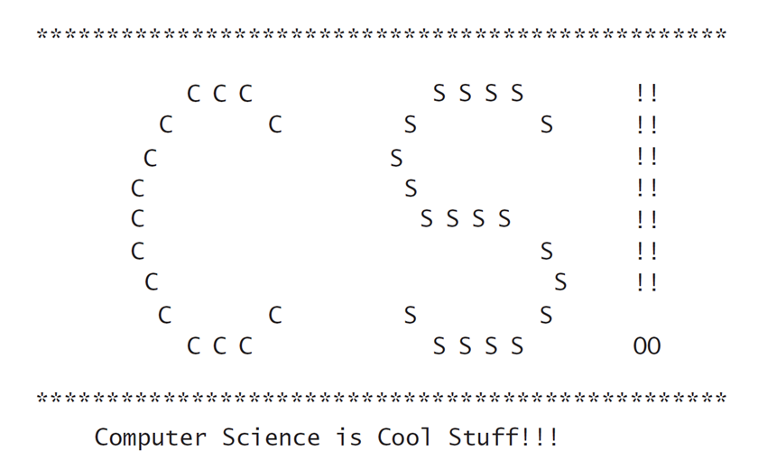

# Exericse 1
## Instructions  

Write a code that cout the following patterns.

```
*****
****
***
**
*
```
# Exercise 2
## Instructions  

Write a code that cout the following pattern. Have fun and be creative. 

```
(             )
 `--(_   _)--'
      Y-Y
     /@@ \
    /     \
    `--'.  \             ,
        |   `.__________/)
```

You can find more interesting patterns at https://www.asciiart.eu/

# Homework
## instructions
# Instructions  

Write a program that prints out “C S !” in large block letters inside a
border of *s followed by two blank lines then the message Computer
Science is Cool Stuff. The output should look as follows:
